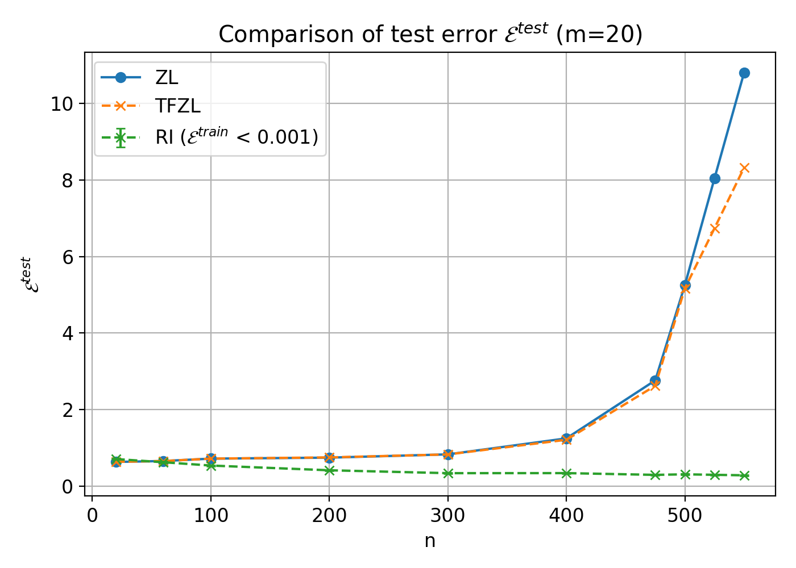
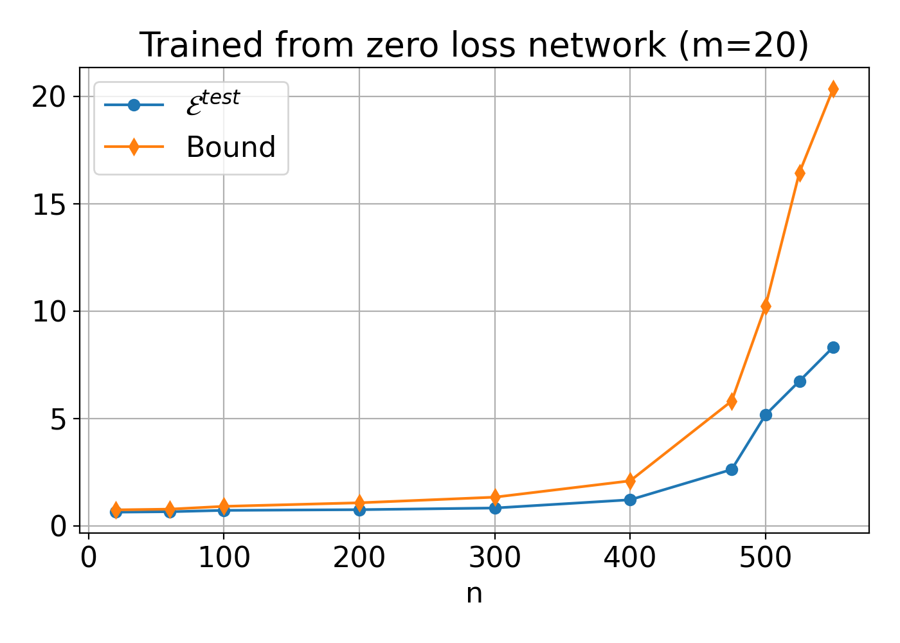
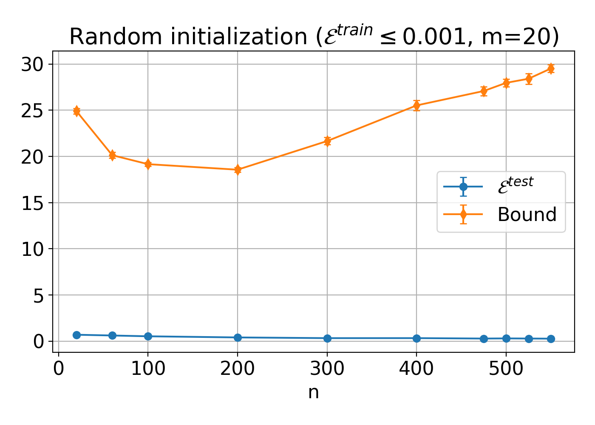
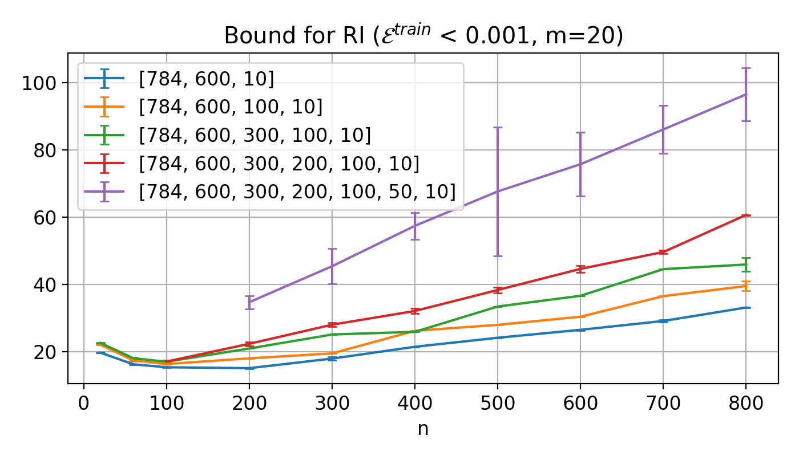
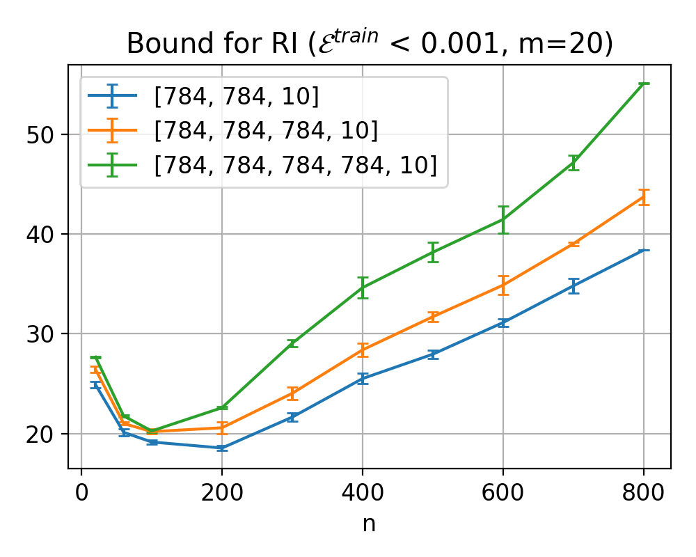

# BBCEM

`BBCEM.ipynb` was used to generate data for [*Architecture independent generalization bounds for overparametrized deep ReLU networks*](https://arxiv.org/abs/2504.05695), by Anandatheertha Bapu, Thomas Chen, Chun-Kai Kevin Chien, Patrícia Muñoz Ewald, and Andrew G. Moore. 

Better resolution versions of the figures in the manuscript can also be found here.

